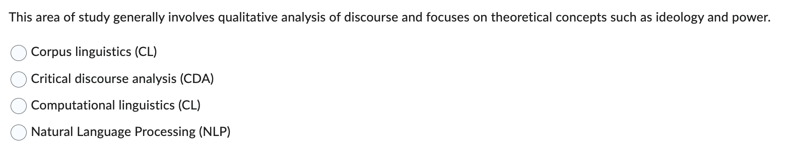
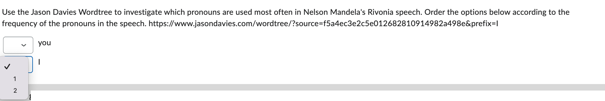
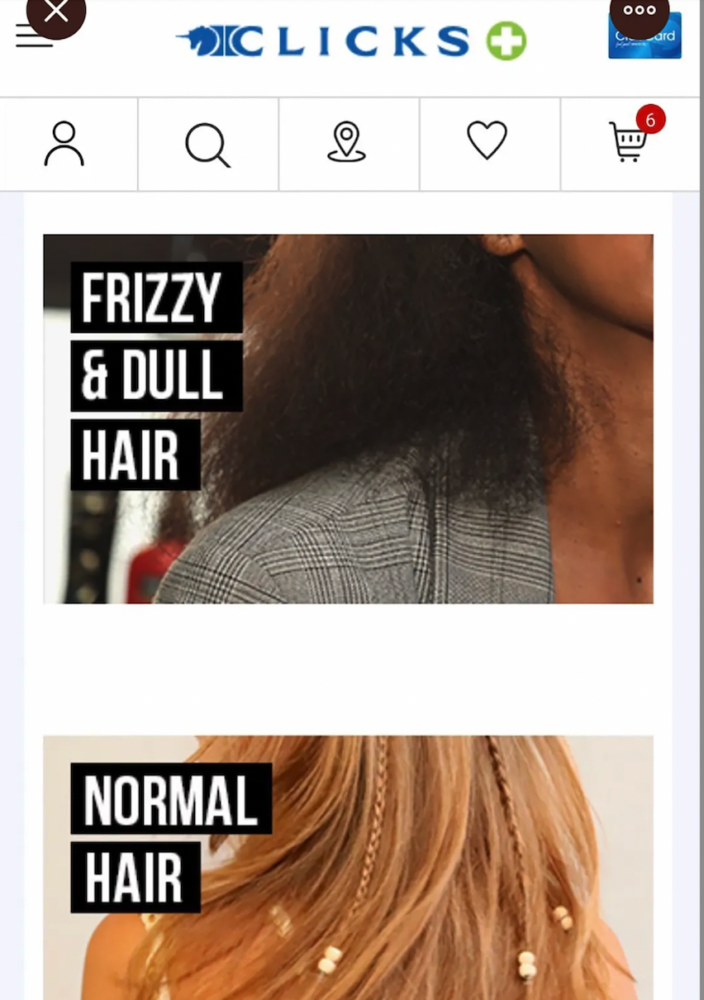
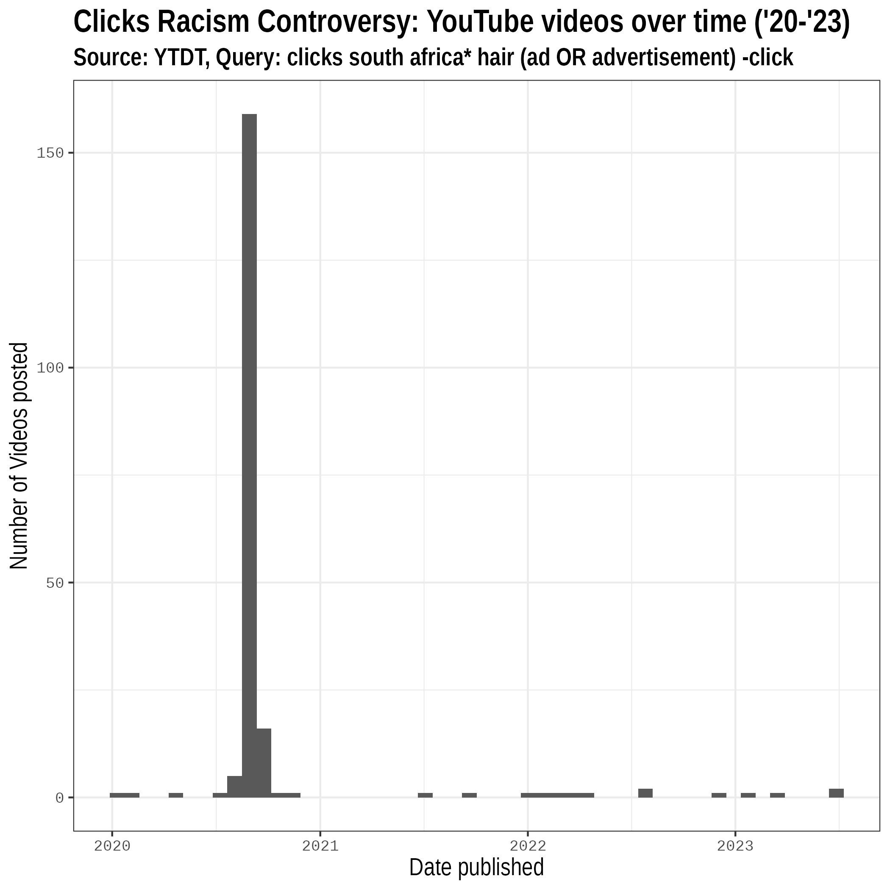
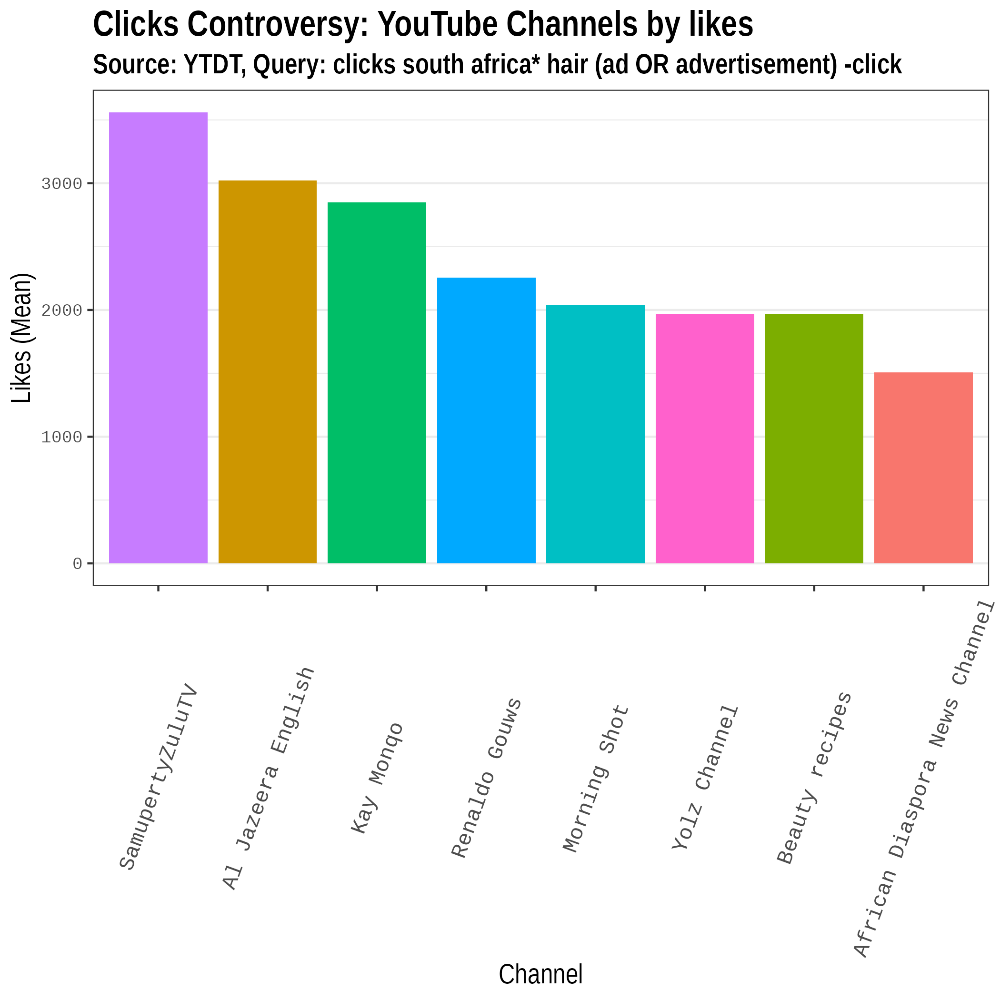
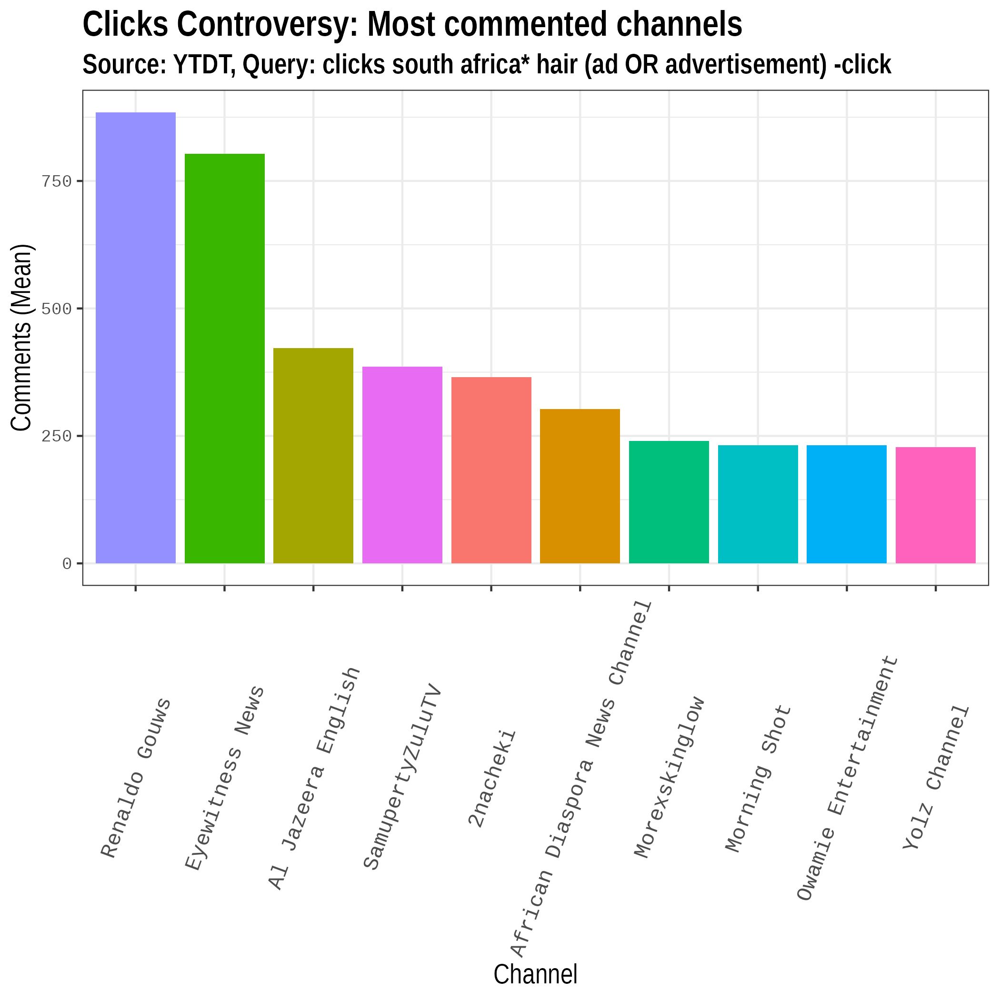
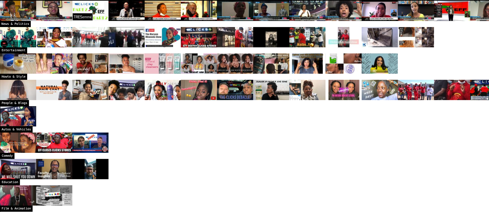

```{r setup, include=FALSE}
#Load required packages

require(quanteda)
require(ggplot2)
require(tidyverse)
require(here)
require(quanteda.textstats)
#install.packages("quanteda.textplots",dependencies =T,repos = "http://cran.us.r-project.org")
#install.packages("udpipe",dependencies =T,repos = "http://cran.us.r-project.org")
#install.packages("spacyr",dependencies =T,repos = "http://cran.us.r-project.org")
require(quanteda.textplots)
require(quanteda.textmodels)
require(udpipe)
require(spacyr)
require(knitr)
require(kableExtra)

#install.packages("topicmodels",dependencies =T)
require(topicmodels)
require(glue)


```

# Outline

1.  What is discourse?
2.  Computational linguistics overview
3.  Discourse analysis & Corpus linguistics
4.  Automating content analysis in Media studies
5.  Multimodal discourses

# Quiz

-   Multiple Choice Questions
-   Take-home, Randomized

Question types:

1.  Based on readings
2.  Use Wordtree and Voyant tools to answer questions about [Mandela speech](https://www.jasondavies.com/wordtree/?source=f5a4ec3e2c5e012682810914982a498e&prefix=I) and [Clicks Corpus](https://voyant-tools.org/?corpus=022c172c263bca71ae0b94bbd8fe4da2&stopList=stop.multi.txt&panels=cirrus,reader,trends,summary,contexts).
3.  Apply concepts from readings to examples from Clicks corpus 

# From readings




# Using Wordtree



# Lecture 2 - Beyond frequency

## Meanings are contextual

Need to go beyond simply counting frequencies.

Context plays an important role in meaning.

For discourse analysis, frequent clusters of words are more revealing than just looking at individual words in isolation

## Concepts

-   Collocation 
-   Concordances
-   Keyness

## Social media corpus

In this lecture we'll be investigating a dataset of 200 Youtube videos focused on the controversy about a Tresseme advert posted on the Clicks website in September 2020.

The text-based corpus includes:

- Text descriptions of the videos (n=200)
- Comments (n=3417) on a random sample of the videos (n=60)
- AI Transcriptions of the audio tracks (n=58)
- Google Vision labels for thumbnails (n=131) and keyframes (n=3267) from videos

---


---

## Social media corpus

200 posts were selected from results returned by the YouTube API in response to the following query: "Query: clicks south africa\* hair (ad OR advertisement) -click" covering videos posted during the period 2020 - 2023 

Posts were selected if they:

- Related directly to the controversy, or 
- Related to issues about body politics and racism

A random sample (n=60) was selected for discourse analysis.
---


##  {background-color="white" background-image="img/image-wall-clicks.png"}

#



## Most Prolific Channels

```{r}


transcriptions_vinfo <- read_csv(
  here("data","sample_60_transcriptions_videoinfo.csv"),
  na= ""
)

transcriptions_text <- transcriptions_vinfo %>%
  rename(date = published_at)  %>%
  mutate(post_id=video_id) %>%
  rename(category = video_category_label) %>%
  rename(channel = channel_title) %>%
  subset(select = c(post_id,text,date,channel,category) )

mystopwords <- stopwords("english",
                         source="snowball")


channel_size <- transcriptions_text %>%
  group_by(channel) %>%
  summarise(count_by_channel = n())

channel_size <- arrange(channel_size,desc(count_by_channel))

table1_md <- kable(channel_size, caption = "Transcriptions: Top Channels (n=60)", "html") %>%
  kable_styling(font_size = 10)
table1_md

```

#



#




#



```{r}
## exclude common english words
mystopwords <- stopwords("english",
                         source="snowball")
## exclude search terms, branding features and other spam
mystopwords <- c("news","via","newzroom","dstv","social","media","visit","us",
                 "like","subscribe","please","video",
                 "twitter","instagram","facebook","youtube",
                 "online","sabcnews.com","copyright","clicks","hair",
                 "#coronavirus","#covid19","#dstv403","#covid","19news",
                 "#sabcnews","#clicks","#eff",
                 "|","=","~",
                 "advertisement","ad","advertise","south","africa",
                 "ft","thumbnail","kabza","semi","tee","vigro","njelic","mthuda"
                 ,"ntokzin","focalistic","de","small",
                 "na",
                 mystopwords)


```


# Collocation

## Collocation

The above-chance frequent co-occurrence of two words within a pre-determined span, usually five words on either side of the word under investigation (the node) (see Sinclair, 1991)

The statistical calculation of collocation is based on three measures:

-   The frequency of the word/node,

-   The frequency of the collocates, and

-   The frequency of the collocation.


# Video Descriptions


## Frequencies

```{r}

# load file with video metadata (you tube data tools)
videos <- read_csv(
  here("data","youtube-27082024-open-refine-200-na.csv"),
  na= ""
)

videos_text <- videos %>%
  rename(text = video_description)  %>%
  rename(post_id = video_id) %>%
  rename(date = published_at_sql) %>%
  rename(category = video_category_label) %>%
  subset(select = c(post_id,text,date,category) )

write_csv(videos_text["text"],"data_output/videos_text.csv")

d <- corpus(videos_text) %>%
  tokens(remove_punct=T) %>%
  dfm() %>%
  dfm_remove(mystopwords)

textplot_wordcloud(d, max_words=50, min_size = 1.5,
  max_size = 5 )

topfeatures(d)
```

# Stopwords

## Context-specific

- Languages
- Search queries (e.g. Clicks, advertisement)
- Discourses

## Stopwords in Voyant Tools

Use Voyant Tools to add stopwords to the [Clicks Corpus](https://voyant-tools.org/?corpus=022c172c263bca71ae0b94bbd8fe4da2&stopList=stop.multi.txt&panels=cirrus,reader,trends,summary,contexts).

## Collocations

We will explore collocation in the descriptions of the videos sample (n=200)

---

```{r}
require(knitr)
d <- corpus(videos_text) 

toks_videos <- tokens(d, remove_punct = TRUE)
tstat_col <- tokens_select(toks_videos, pattern = "^[a-z]",
                                valuetype = "regex",
                                case_insensitive = TRUE,
                                padding = TRUE) %>%
  tokens_remove(mystopwords) %>%
  textstat_collocations(min_count = 5)
#head(tstat_col, 20)

table1_md <- kable(tstat_col[1:20,1:2], caption = "Top Collocations: Video Descriptions (n=200)", "html") %>%
  kable_styling(font_size = 15)
table1_md

```

## Starting points - Stopwords

- Experiment with a suitable Stoplist for the [Clicks Video Descriptions in Voyant Tools - with Stop List](https://voyant-tools.org/?corpus=022c172c263bca71ae0b94bbd8fe4da2&stopList=stop.multi.txt&panels=cirrus,reader,trends,summary,contexts)


# Concordance

## Concordance

-   A list of all the occurrences of a particular search term in a corpus, presented within the **`context that they occur in`**, usually a few words to the left and right of the search term.

- **`Co-text`** allows analyst to infer (some) context

Context allows us to address **`qualitative research`** questions

## KWIC

-   Concordance is also known as "key word in context" or KWIC analysis


## Concordance for MCQ

1.  [Wordtree](https://www.jasondavies.com/wordtree/) by Jason Davies
2.  Multilingual concordancer by [Voyant Tools](https://voyant-tools.org/)
3. [Rivonia Speech in Voyant Tools - with Stop List](https://voyant-tools.org/?corpus=34960420ae71ddccd7d2a363bd676392&stopList=stop.multi.txt&panels=cirrus,reader,trends,summary,contexts)
4. [Clicks Video Descriptions in Voyant Tools - with Stop List](https://voyant-tools.org/?corpus=022c172c263bca71ae0b94bbd8fe4da2&stopList=stop.multi.txt&panels=cirrus,reader,trends,summary,contexts)
5. [Clicks Comments (Random sample) in Voyant Tools - with Stop List](https://voyant-tools.org/?corpus=999ec9a5afffeb064d5ccffbc5afd28e&stopList=stop.multi.txt&panels=cirrus,reader,trends,summary,contexts)

## Starting points - Concordance

- Compare "controversial advert" to "racist advert" in the [Clicks Video Descriptions in Voyant Tools - with Stop List](https://voyant-tools.org/?corpus=022c172c263bca71ae0b94bbd8fe4da2&stopList=stop.multi.txt&panels=cirrus,reader,trends,summary,contexts)
- Compare "controversial" to "racist" in the [Clicks Comments (Random sample) in Voyant Tools - with Stop List](https://voyant-tools.org/?corpus=999ec9a5afffeb064d5ccffbc5afd28e&stopList=stop.multi.txt&panels=cirrus,reader,trends,summary,contexts)
- Compare concordances of "beautiful" and "ugly" and "dark" and "light" in the [Clicks Comments (Random sample) in Voyant Tools - with Stop List](https://voyant-tools.org/?corpus=999ec9a5afffeb064d5ccffbc5afd28e&stopList=stop.multi.txt&panels=cirrus,reader,trends,summary,contexts)

## Clicks data

You can download both datasets from the links below:

- [Video description text](https://marionwalton.github.io/media-test/data/videos_text.txt) (1964)
- [Comments text](https://marionwalton.github.io/media-test/data/comments_text.txt) (1994)


# Keyness

## What is keyness?

"**`Keyness`** is defined as the statistically significantly higher frequency of particular words or clusters in the corpus under analysis in comparison with another corpus, either a general reference corpus, or a comparable specialised corpus. Its purpose is to point towards the "aboutness" of a text or homogeneous corpus (Scott, 1999), that is, its topic, and the central elements of its content."

## Research and keyness

Keyness allows us to address comparative research questions such as:

- What kinds of discourse are associated with News and Youtuber/influencer channels respectively?


## Comparing keyness across categories

```{r}

d = corpus(videos_text)


# Create subcorpus from the News/poltics and People/Blogs + Entertainment categories
corp_category <- corpus_subset(d,
                 category %in% c("News & Politics",
                                 "Entertainment",
                                 "People & Blogs", 
                                 "Autos & Vehicles",
                                 "Comedy"))

# Create a dfm grouped by category
dfmat_cat <- tokens(corp_category, remove_punct = TRUE,
                    remove_symbols=TRUE, remove_url = T) |>
  tokens_keep("^\\p{LETTER}", valuetype="regex")|>
  tokens_remove(mystopwords) |>
  tokens_group(groups = category) |>
  dfm()

# Calculate keyness and determine News as target
tstat_keyness <- textstat_keyness(dfmat_cat, target = "News & Politics")

# Plot estimated word keyness
textplot_keyness(tstat_keyness)

```

# Conclusion

## Limits of "co-text"

Tools such as collocation, concordance and keyness allow us to investigate textual "co-text" and infer some contextual features.

Situated meanings are elusive but broader textual patterns can be distinguished.

Multimodality is a central aspect of context. Multimodal meanings are challenging to access with current tools.

# Note

## TF-IDF

TF-IDF (Term Frequency-Inverse Document Frequency) is a commonly used measure of keyness.

How important is a word is within a document relative to a collection of documents (corpus)? 

Can help highlight key words that distinguish a document while reducing the importance of commonly used words that appear in most documents.

- Term Frequency (TF) - how frequently a word appears in a document
- Inverse Document Frequency(IDF) - how unique that word is across all documents in the corpus.
